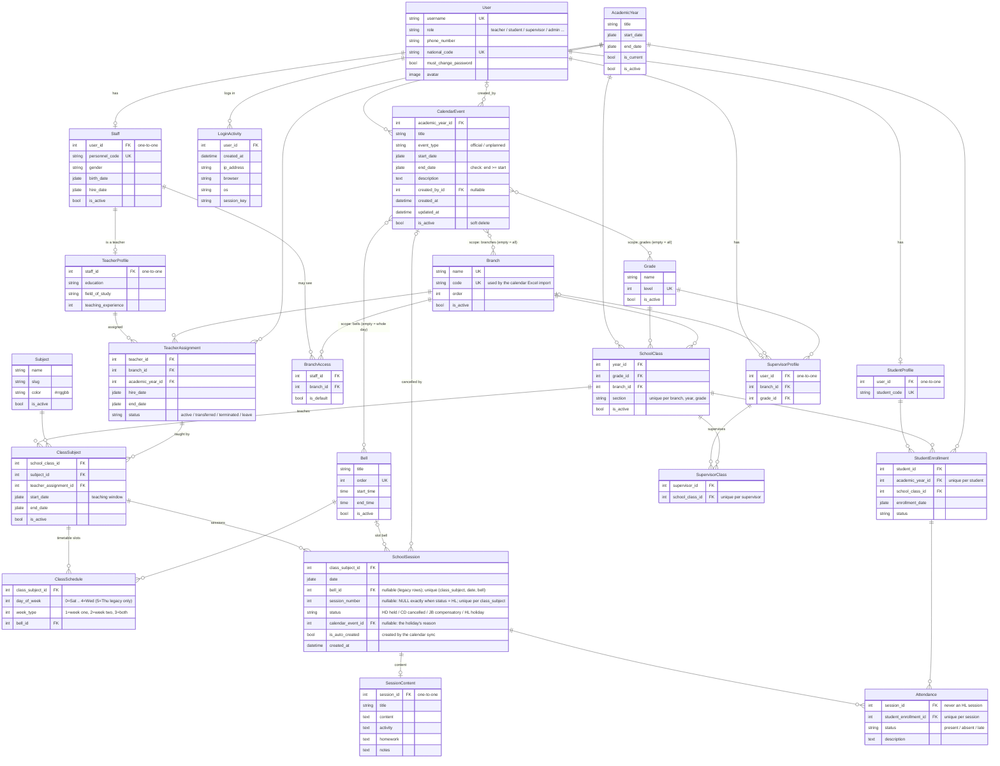

# Database ER Diagram

The school-domain tables and their relations, as Mermaid. Prose descriptions of each model are in [database.md](database.md); the academic calendar's rules are in [apps/academic_calendar.md](apps/academic_calendar.md).

* Dates (`jdate`) are `django_jalali` `jDateField`s: stored in Gregorian, shown in Jalali.
* The website CMS tables (`website` app: site settings, landing page, menus) and Django's own tables are left out.
* Every table also has an `id` primary key (not repeated below except where it helps).

## Academic calendar constraints at a glance

| Table | Constraint | Meaning |
| --- | --- | --- |
| `CalendarEvent` | `calendar_event_end_after_start` | `end_date >= start_date` |
| `SchoolSession` | `unique_session_number_per_class_subject` | numbers are unique per class subject (NULLs never collide) |
| `SchoolSession` | `unique_session_per_slot` | one session per `(class_subject, date, bell)` when `bell` is set |
| `SchoolSession` | `session_number_only_when_counted` | `status = 'HL'` ⇔ `session_number IS NULL` |
